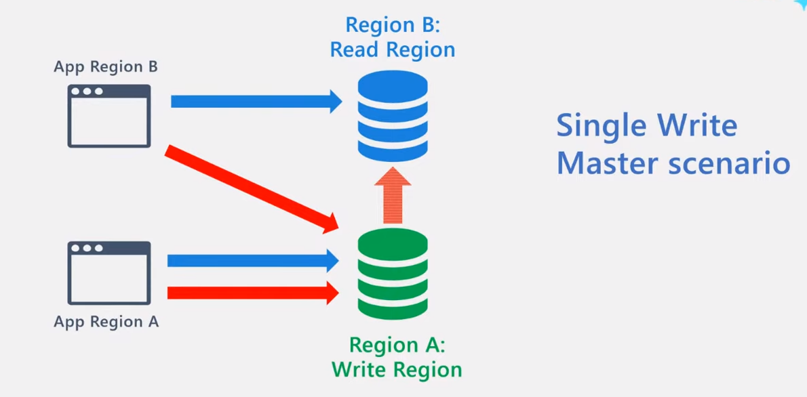
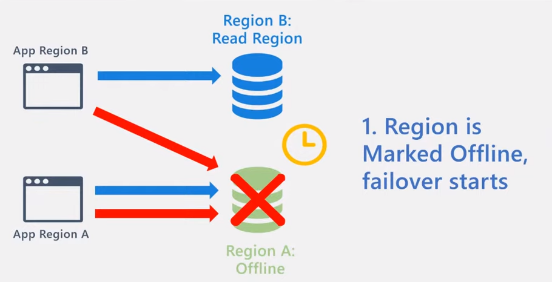
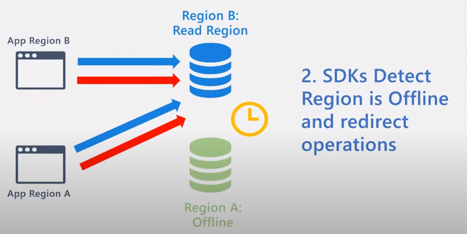
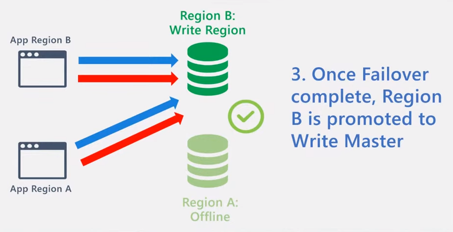
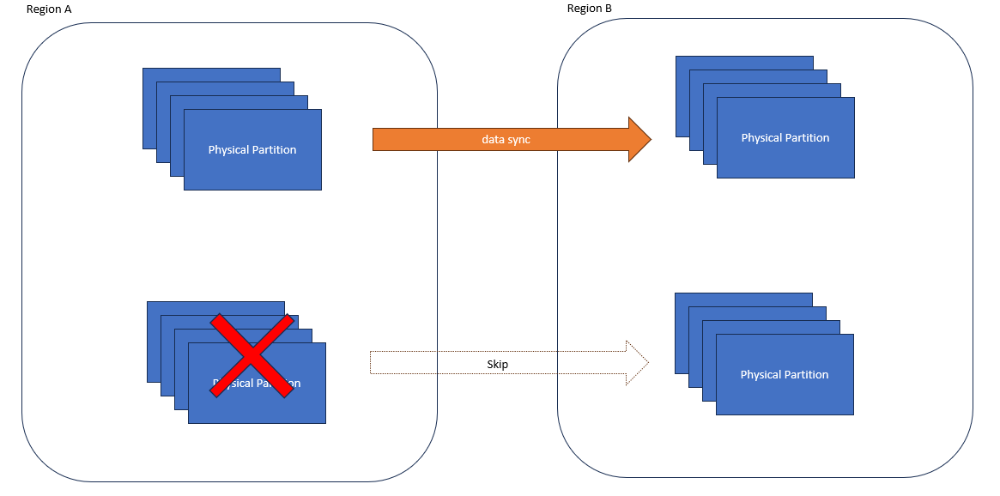

こんにちは。Cosmos DB サポートチームの星井と申します。

この記事では、Cosmos DB における RTO, RPO, フェールオーバー（特にサーバー側で処理されるもの）について、典型的な事例をもとに説明します。
Cosmos DB の可用性に関する設定や運用設計に際し、これらの情報がお役に立てましたら幸いです。

本記事は、以下の弊社公開記事、弊社アーキテクト/開発者によるビデオを参考に執筆いたしました。本記事について詳細を確認されたい場合、ご参考になれば幸いです。

* [Azure Cosmos DB を使用して高可用性を実現する](https://learn.microsoft.com/ja-jp/azure/cosmos-db/high-availability)
* [Architecting Azure Cosmos DB for High Availability - Global User Group Dec. 2022](https://youtu.be/fg8n5SuUwRI)
* [Forced Failover in Azure Cosmos DB - Episode 46](https://youtu.be/G5R2tr1gvkY)

<!--more-->

## 本記事で扱う Cosmos DB の構成とシナリオ

以下のような複数リージョン、単一書き込みリージョンの構成にて、サービスマネージド フェールオーバーを有効化している場合を考えます。
この構成では、各リージョンのクライアントからの書き込みは単一の書き込みリージョンに向けて実行されます。一方で読み取りは、クライアントが存在するリージョンに設定することでレイテンシ面で有利になります。

ここで、書き込みリージョンで障害が発生してしまった場合を考えます。
この時、障害が発生したリージョンへのリクエストは一部ないしはすべて失敗することになります。
一方で Cosmos DB サービスは、リージョン レベルの大規模障害を検知すると当該リージョンをオフラインに設定し、フェールオーバーを開始します。

また、Cosmos DB の SDK は、リージョン障害を検知すると、リクエストの宛先をオンラインのリージョンに切り替えます。

> [!NOTE]
> Cosmos DB SDK のフェールオーバーの挙動や設定について詳細は、[複数リージョン環境での Azure Cosmos DB SDK の可用性の診断とトラブルシューティング](https://learn.microsoft.com/ja-jp/azure/cosmos-db/nosql/troubleshoot-sdk-availability) をご覧ください。

Cosmos DB サービスによるフェールオーバーが完了すると、フェールオーバー先のリージョンが書き込みリージョンとなります。

> [!NOTE]
> フェールオーバー完了後、 Region A が自動で再び書き込みリージョンに戻るわけではない点にご注意ください。上の例ですと、 Region A の App からの書き込みリクエストのレイテンシは、リージョン間の通信往復時間を考えると、障害発生前に比べて悪化することになります。

## RTO と RPO

本記事における RTO と RPO について、以下のように定義します。

* 回復時間の目標 (RTO): Azure Cosmos DB に影響を与える停止の開始から完全な可用性への復旧までの時間。
* 回復ポイントの目標 (RPO): 正しく復元された最後の書き込みから Azure Cosmos DB に影響を与える停止の開始時刻までの時間。

> [!NOTE]
> [Azure Cosmos DB を使用して高可用性を実現する](https://learn.microsoft.com/ja-jp/azure/cosmos-db/high-availability)

## Cosmos DB の RTO

リージョン障害の発生から、フェールオーバーが開始されるまでの時間について 15 + α 分を目標として製品の開発運用を行っております。
上記事例において、障害発生リージョンがオフラインになるまでの目標時間が 15 分であると言い換えることもできます。

## Cosmos DB の RPO

Cosmos DB アカウントに保管しているデータの RPO は、アカウントに設定しているバックアップの設定や、書き込み処理の整合性レベルにより変動します。

### バックアップ設定について

バックアップについて、 Cosmos DB では継続的/定期的の2種類のバックアップがあります。既定の設定は定期的バックアップになっています。

・[継続的バックアップ](https://learn.microsoft.com/ja-jp/azure/cosmos-db/continuous-backup-restore-introduction)では、100 秒ごとに各リージョンがバックアップされます。 RPO は 100 秒となります。
・[定期的なバックアップ](https://learn.microsoft.com/ja-jp/azure/cosmos-db/periodic-backup-restore-introduction)では、最小バックアップ間隔は 1  時間です。 RPO は設定次第ですが、最短で 1時間となります。

### 整合性レベルについて

書き込みの整合性レベルは、読み取りリージョンにデータがレプリケーションされるタイミングに影響します。強い (Strong) 整合性レベルは、読み取りリージョンにデータがレプリケーションされた後にクライアント側に成功レスポンスを返すため RPO は 0 になります。
それ以外の整合性レベルにおいては、クライアント側への書き込み成功レスポンスが返った後、読み取りリージョンへのレプリケーション完了までに時間差があります。このため、レプリケーションが完了する前に書き込みリージョンで障害が発生し、かつそのデータがバックアップもされていない場合、ロストする可能性はあります。

| 整合性レベル        | リージョンの停止に対する RPO |
| ------------- | -------------|
| セッション、一貫性のあるプレフィックス、最終的      | 15 分未満 |
| Bounded staleness      | K および T  （K と T の最小値は 100,000 回の書き込み操作または 300 秒です。）|
| Strong | 0      |

> [!NOTE]
> [Azure Cosmos DB を使用して高可用性を実現する](https://learn.microsoft.com/ja-jp/azure/cosmos-db/high-availability#durability)

## Cosmos DB のフェールオーバー

Cosmos DB のサーバー側で行われるフェールオーバーには、以下の２種類があります。

* サービスマネージド フェールオーバー
* 手動フェールオーバー

Cosmos DB のフェールオーバーの挙動を理解することは、サービスマネージド フェールオーバーと手動フェールオーバーの違いを理解するのに有用と思いますので紹介します。

### Gracefullness Check

フェールオーバーにおいて、 Cosmos DB 内部では Gracefullness Check という処理が行われています。
これは Cosmos DB サービスが、フェールオーバー先で書き込みを受け付け可能にするため、フェールオーバー元のデータをフェールオーバー先に同期させる処理です。

> [!NOTE]
> 読み取りリージョンのデータは強い整合性レベルの場合を除き、書き込みリージョンに対して古いデータを含んでいる可能性があります。このため、フェールオーバー先で書き込みを受け付け可能にするために、まずフェールオーバー先のデータを最新化する必要があります。

ただし、フェールオーバー元リージョンで障害が発生している場合、以下の図ように一部のパーティションにはアクセスができないことがあります。このようなパーティションに対し、 Cosmos DB サービスは Gracefullness Check をスキップします。すなわち、このようなパーティションに書き込まれたデータは一部ロストする可能性があります。

Gracefullness Check について詳細を把握されたい場合、以下の弊社開発者による説明動画をご覧ください。
[Forced Failover in Azure Cosmos DB - Episode 46](https://youtu.be/G5R2tr1gvkY?t=885)

### サービスマネージド フェールオーバー

サービスマネージド フェールオーバーは、 Cosmos DB サービスが起動する、書き込みリージョンを変更する処理です。
Cosmos DB アカウントに対してサービスマネージド フェールオーバーを有効化すると、リージョンで障害が発生した際に、 Cosmos DB サービスが自動でフェールオーバーを行います。
ポイントとしては、フェールオーバー元リージョンで障害が発生しているため、一部パーティションに対して Gracefullness Check が成功しない可能性があります。この時、 Cosmos DB サービスはそのようなパーティションに対する Gracefullness Check をスキップするため、一部データがロストする可能性があります。

また、フェールオーバーに要する時間は、データの同期時間に依存します。これは、当該アカウントにて稼働しているパーティションの数や、データの格納量の影響を受けます。

さらに、リージョンが障害から復旧した後、競合フィードが発生する可能性があります。
これは、 書き込み後、別リージョンにレプリケーションされる前に障害が発生してしまったデータが対象となります。
言い換えると、Gracefullness Check が行われなかったパーティション内のデータと、フェイルオーバー後の書き込みリージョンに書き込まれたデータの間で競合 フィードが発生し得ます。
競合が発生したデータについては個別に解決するか否か検討のうえ、必要であれば解決します。

> [!NOTE]
> [複数の書き込みリージョンを使用する場合の競合の種類と解決ポリシー](https://learn.microsoft.com/ja-jp/azure/cosmos-db/conflict-resolution-policies)
> [Forced Failover in Azure Cosmos DB - Episode 46](https://youtu.be/G5R2tr1gvkY?t=1183)

### 手動フェールオーバー

手動フェールオーバーは、ユーザーが起動する、書き込みリージョンを変更する処理です。
ポイントとしては、 全てのパーティションについて Gracefullness Check が成功した段階で、フェールオーバーが完了する点になります。このため、障害が現に発生している時の手動フェールオーバーの利用は想定されていません。

手動フェールオーバーの用途としては、以下のようなものがあります。

#### リージョンが障害から回復した後、書き込みリージョンを戻す

今回の事例ですと、リージョン B へのフェールオーバーが完了した後、書き込みリージョンはリージョン B になります。
その後リージョン A が復旧した際、書き込みリージョンを再度 A に戻すケースが考えられます。このような時、手動フェールオーバーを用います。

> [!NOTE]
> 例えば、書き込みを行うアプリケーションがリージョン A にしか存在しない場合や、リージョン A のアプリケーションによる書き込み量が多い場合、リージョン B で書き込みを受け付けるのは通信の往復時間を考慮するとレイテンシ面で不利になります。

#### Cosmos DB のリージョン移行

例えば、東日本リージョン単一で稼働する Cosmos DB を西日本単一リージョンに移行したいとします。
このとき、以下のような手順でリージョン移行を行うことができます。

1. Cosmos DB アカウントに西日本リージョンを追加する
2. 手動フェールオーバーを用いて、書き込みリージョンを西日本に変更する
3. 東日本リージョンを削除する

> [!NOTE]
> 上記手順は、運用環境での実施の前に、検証環境でご検証ください。

#### Follow The Sun モデルのビジネス対応

例として、北米、アジア、ヨーロッパでビジネス展開をしており、各リージョンにてアプリケーションと Cosmos DB が稼働している場合を考えます。
この際、手動フェールオーバーを用いて以下のように時間経過に応じて書き込みリージョンを変更していくことで、多くの書き込みリクエストのレイテンシを低く抑えることができる可能性があります。

* 北米での日中時間帯：書き込みリージョンを北米にする
* アジアでの日中時間帯：書き込みリージョンをアジアにする
* ヨーロッパでの日中時間帯：書き込みリージョンをヨーロッパにする

## サービスマネージド/手動フェールオーバーの違い

サービスマネージドと手動フェールオーバーを違いをまとめると以下のようになります。

| 操作/シナリオ        | 手動フェールオーバー | サービス マネージド フェールオーバー |
| ------------- |:-------------:|-------------:|
| ユーザーによってトリガーされるか | Yes | No |
| サービスによってトリガーされるか | No | Yes |
| リージョン障害中にトリガーされるか | No | Yes |
| フェールオーバー元の書き込みリージョンがオフラインになるか | NA | Yes |
| フェールオーバー元の書き込みリージョンが復旧した後、オンラインになるか | NA | Yes |
| レプリケーションされていないデータについて、競合フィードが発生し得るか (NoSQL APIのみ) | NA | Yes |
| 全パーティションのデータが、フェールオーバー先リージョンに同期されたことを確認するか | Yes | No |
| 全ての API で利用できるか | Yes | Yes |
| マルチ書き込みリージョンに適用できるか | No | No |

> [!NOTE]
> [Forced Failover in Azure Cosmos DB - Episode 46](https://youtu.be/G5R2tr1gvkY?t=1471)
> (動画の内容は一部古い情報を含みます。あくまでも参考としてご覧ください)

## まとめ

最後までお読みくださりありがとうございました。この記事では、事例を通して、Cosmos DB における RTO, RPO, フェールオーバーの考え方をご紹介いたしました。
ご不明な点がございましたら、お気軽に [Azure サポート窓口までお問い合わせ](https://learn.microsoft.com/ja-jp/azure/azure-portal/supportability/how-to-create-azure-support-request)ください。よろしくお願いいたします。
