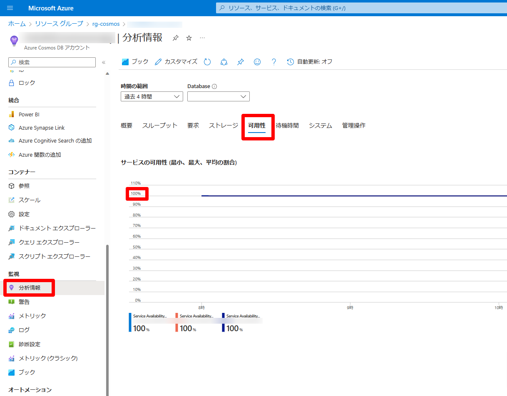
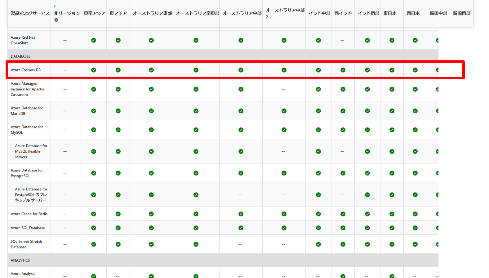

こんにちは。Cosmos DB サポートチームの星井と申します。

本記事では アプリケーションから Cosmos DB for NoSQL に繋がらない場合、問題が Cosmos DB サービス側に起因するか否かの切り分け方法をご案内します。
<!--more-->
## Cosmos DB の可用性の確認

Azure ポータルの Cosmos DB 管理画面から、
分析情報＞可用性タブ にて、 Cosmos DB アカウントの可用性の情報をご確認可能です。
サービスの可用性の値が 100% を下回っている場合、 Cosmos DB サービスで問題が発生している状況です。
数分間以上この状態が継続してしまっている場合、お手数ですが、Azure サポートまでお問い合わせください。

## Azure サービスの状態確認

[Azure の状態](https://azure.status.microsoft/ja-jp/status) にて、 Azure サービスの状態をリージョンごとに確認することが可能です。
「Databases」＞「Azure Cosmos DB」の行にて、ご利用中のリージョンにチェック以外のマークがついている場合、当該リージョンの Cosmos DB サービスで何らかの問題が発生している可能性があります。
お手数ですが、Azure サポートまでお問い合わせください。

> [!WARNING]
> Azure サービスの状態はリージョン全体で問題が発生している場合に更新されます。個別の Cosmos DB アカウントが不調な場合は、まずCosmos DB の可用性をご確認ください。

## Cosmos DB サービスのメトリクスやログの確認

Cosmos DB の分析情報や診断情報を用いて、エラー原因の切り分けをすることが可能です。
Cosmos DB サービスに問題がある場合に発生し得るエラーの切り分け方法について、詳細は以下の公開記事に記述されています。

* [Azure Cosmos DB の要求率が大きすぎる (429) 例外を診断してトラブルシューティングする](https://learn.microsoft.com/ja-jp/azure/cosmos-db/nosql/troubleshoot-request-rate-too-large?tabs=resource-specific)
* [Azure Cosmos DB の要求タイムアウト例外の問題を診断してトラブルシューティングする](https://learn.microsoft.com/ja-jp/azure/cosmos-db/nosql/troubleshoot-request-timeout)

## Cosmos DB SDK が出力しているエラーコードの確認

アプリケーションにて Cosmos DB .NET/Java SDK を利用している場合、エラーコードやエラーメッセージ、診断情報を用いて問題の詳細な切り分けが可能です。
各種エラーに応じた問題の切り分け方法の詳細は、以下の公開記事に記載されています。

### .NET SDK

* [Azure Cosmos DB サービス利用不可の例外を診断してトラブルシューティングする](https://learn.microsoft.com/ja-jp/azure/cosmos-db/nosql/troubleshoot-service-unavailable)
* [Azure Cosmos DB .NET SDK の要求タイムアウト例外を診断してトラブルシューティングする](https://learn.microsoft.com/ja-jp/azure/cosmos-db/nosql/troubleshoot-dotnet-sdk-request-timeout?tabs=cpu-new)

### Java SDK

* [Azure Cosmos DB Java v4 SDK サービス利用不可の例外を診断してトラブルシューティングする](https://learn.microsoft.com/ja-jp/azure/cosmos-db/nosql/troubleshoot-java-sdk-service-unavailable)
* [Azure Cosmos DB Java v4 SDK の要求タイムアウト例外を診断してトラブルシューティングする](https://learn.microsoft.com/ja-jp/azure/cosmos-db/nosql/troubleshoot-java-sdk-request-timeout)

> [!NOTE]
> Cosmos DB .NET/Java SDK は、診断情報として接続先のレプリカ情報や、詳細なエラーコード、クライアント側のリソース情報（CPU やメモリの使用率）も含めて出力します。
> 全てのリクエストについて診断情報をログに記録するのはパフォーマンスの関係上非推奨ですが、エラーが発生した場合や応答に時間がかかった場合、これをログに記録しておくことをお勧めします。

## お問い合わせに際して

[Cosmos DB サポートへのお問い合わせ](https://learn.microsoft.com/ja-jp/azure/azure-portal/supportability/how-to-create-azure-support-request)に際し、以下の弊チームブログに記載の情報を提供くださいますと、より迅速に調査を進めることが可能になります。

* [Cosmos DB 基本情報採取](../%E6%83%85%E5%A0%B1%E6%8E%A1%E5%8F%96/Cosmos-DB-basicinformationtocollect.md)

> [!NOTE]
> アプリケーション側の情報も合わせて提供いただけますと、問題の原因の早期切り分けに有用です。

## まとめ

最後までお読みくださりありがとうございました。この記事では、アプリケーションが Cosmos DB for NoSQL に接続できない場合において、原因が Cosmos DB サービスにあるかの判別方法をご案内させていただきました。
Cosmos DB に関するトラブルが発生してしまった際のご参考になりましたら幸いです。
ご不明な点がございましたら、お気軽に上記サポート窓口までお問い合わせください。よろしくお願いいたします。
