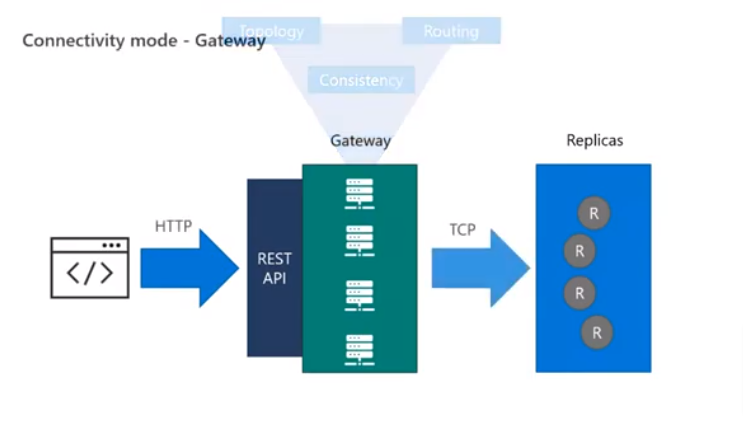
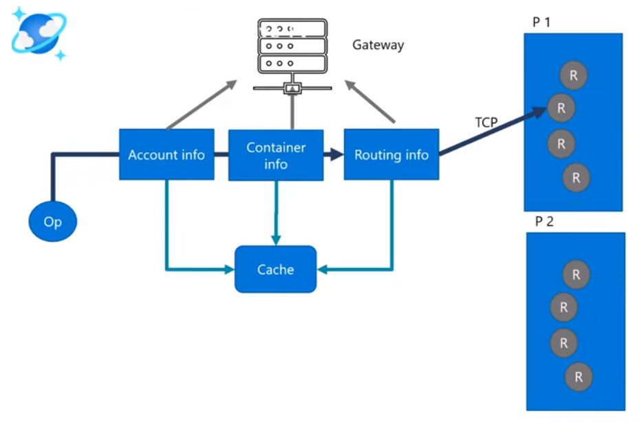
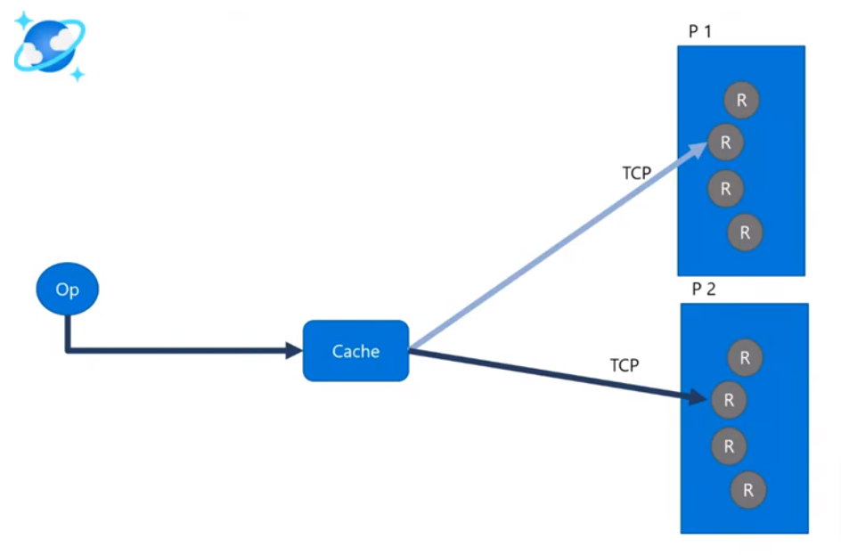

- [概要](#概要)
  - [時間がない方向け](#時間がない方向け)
  - [診断ログとは](#診断ログとは)
  - [診断ログの取得方法](#診断ログの取得方法)
  - [前提知識](#前提知識)
    - [ゲートウェイ モード](#ゲートウェイ-モード)
    - [ダイレクト モード](#ダイレクト-モード)
    - [ゲートウェイとダイレクト モードの比較](#ゲートウェイとダイレクト-モードの比較)
- [Java SDK による診断ログの解析](#java-sdk-による診断ログの解析)
  - [高レイテンシーの原因調査](#高レイテンシーの原因調査)
    - [regionsContacted](#regionscontacted)
    - [transportRequestTimeline](#transportrequesttimeline)
  - [responseStatisticsList の解析](#responsestatisticslist-の解析)
    - [StorePhysicalAddress, transportRequestTimeline](#storephysicaladdress-transportrequesttimeline)
    - [CPU usage history](#cpu-usage-history)
  - [400 系エラーの原因調査](#400-系エラーの原因調査)
    - [substatusCode](#substatuscode)
    - [retryAfterInMs](#retryafterinms)
    - [PartitionKeyRangeId](#partitionkeyrangeid)
    - [retryContext](#retrycontext)
  - [500 系エラーの原因調査](#500-系エラーの原因調査)
  - [clientCfgs の解析](#clientcfgs-の解析)
  - [how to diagnose 429 errors](#how-to-diagnose-429-errors)
    - [statusCode](#statuscode)
  - [high latency scenario](#high-latency-scenario)
  - [high volume scenario](#high-volume-scenario)
  - [burst scenario](#burst-scenario)
  - [connCfg の見方](#conncfg-の見方)
  - [見出し (大)](#見出し-大)
    - [見出し (中)](#見出し-中)
      - [見出し (小)](#見出し-小)


# 概要

こんにちは、 Azure Cosmos DB サポートチームの星井と申します。
この記事では、 Azure Cosmos DB Java SDK を用いての診断ログの取得と解析方法をご紹介します。

## 時間がない方向け

本記事でご紹介する内容の概要は、以下の通りになります。

| 問題 | 確認対象の診断 | 確認内容 |
| :---: | :---: | :---: |
| 高レイテンシー | regionsContacted<br>transportRequestTimeline<br>retryContext | アプリケーションと接続対象 Cosmos DB が同一リージョンに存在するか<br>クライアント側で遅延が発生しているか、サーバー側の問題か切り分け<br>Cosmos DB 側に十分なスループットがプロビジョンされているか |
| 400 系エラーが多発 | statusCode<br>subStatusCode<br>retryContext | -  |
| 500 系エラーが多発 | systemInformation<br>clientCfgs<br>transportRequestTimeline | - |


## 診断ログとは
診断ログは、 Cosmos DB 利用に際してのトラブルの原因切り分けにあたっての重要なヒントとなります。
Cosmos DB Java SDK が出力する診断ログには、 Cosmos DB のクライアント、サーバーに関する以下情報が含まれています。

* 各種データ操作に関するエラーやパフォーマンス メトリクス
* クライアントサーバー間の接続情報（接続対象リージョンやレプリカ等）
* クライアント側のメトリクス（CPU 使用率等)

<details>
  <summary>アイテムを作成したときの診断ログサンプル(クリックして展開)</summary>
  
```
{
    "userAgent": "azsdk-java-cosmos/4.40.0 Windows11/10.0 JRE/1.8.0_351",
    "activityId": "3d5cd228-b31d-11ed-b8f6-294b49b2df33",
    "requestLatencyInMs": 1689,
    "requestStartTimeUTC": "2023-02-23T01:56:07.637Z",
    "requestEndTimeUTC": "2023-02-23T01:56:09.326Z",
    "responseStatisticsList": [
        {
            "storeResult": {
                "storePhysicalAddress": "rntbd://cdb-ms-prod-eastus1-be33.documents.azure.com:14050/apps/eb821fd6-b356-42cd-a806-8dc3afb49f7a/services/80bfad6e-1938-4a7f-90e0-4a3002ded1f9/partitions/6dc156cd-202e-46a3-b28b-4406071ed9b7/replicas/133215909009594238p/",
                "lsn": 233,
                "globalCommittedLsn": 225,
                "partitionKeyRangeId": null,
                "isValid": true,
                "statusCode": 429,
                "subStatusCode": 3200,
                "isGone": false,
                "isNotFound": false,
                "isInvalidPartition": false,
                "isThroughputControlRequestRateTooLarge": false,
                "requestCharge": 0.38,
                "itemLSN": -1,
                "sessionToken": null,
                "backendLatencyInMs": null,
                "retryAfterInMs": 500.0,
                "exceptionMessage": "[\"Request rate is large. More Request Units may be needed, so no changes were made. Please retry this request later. Learn more: http://aka.ms/cosmosdb-error-429\"]",
                "exceptionResponseHeaders": "{x-ms-current-replica-set-size=4, lsn=233, x-ms-request-charge=0.38, x-ms-schemaversion=1.15, x-ms-transport-request-id=294, x-ms-number-of-read-regions=2, x-ms-current-write-quorum=3, x-ms-cosmos-quorum-acked-llsn=233, x-ms-quorum-acked-lsn=233, x-ms-activity-id=3cf388f9-b31d-11ed-b8f6-294b49b2df33, x-ms-xp-role=1, x-ms-global-Committed-lsn=225, x-ms-retry-after-ms=500, x-ms-cosmos-llsn=233, x-ms-serviceversion= version=2.14.0.0, x-ms-substatus=3200}",
                "replicaStatusList": [
                    "14050:Connected"
                ],
                "transportRequestTimeline": [
                    {
                        "eventName": "created",
                        "startTimeUTC": "2023-02-23T01:56:07.639Z",
                        "durationInMilliSecs": 0.0
                    },
                    {
                        "eventName": "queued",
                        "startTimeUTC": "2023-02-23T01:56:07.639Z",
                        "durationInMilliSecs": 0.0
                    },
                    {
                        "eventName": "channelAcquisitionStarted",
                        "startTimeUTC": "2023-02-23T01:56:07.639Z",
                        "durationInMilliSecs": 1.0
                    },
                    {
                        "eventName": "pipelined",
                        "startTimeUTC": "2023-02-23T01:56:07.640Z",
                        "durationInMilliSecs": 0.0
                    },
                    {
                        "eventName": "transitTime",
                        "startTimeUTC": "2023-02-23T01:56:07.640Z",
                        "durationInMilliSecs": 182.0
                    },
                    {
                        "eventName": "decodeTime",
                        "startTimeUTC": "2023-02-23T01:56:07.822Z",
                        "durationInMilliSecs": 0.0
                    },
                    {
                        "eventName": "received",
                        "startTimeUTC": "2023-02-23T01:56:07.822Z",
                        "durationInMilliSecs": 0.0
                    },
                    {
                        "eventName": "completed",
                        "startTimeUTC": "2023-02-23T01:56:07.822Z",
                        "durationInMilliSecs": 0.0
                    }
                ],
                "rntbdRequestLengthInBytes": 857,
                "rntbdResponseLengthInBytes": 329,
                "requestPayloadLengthInBytes": 421,
                "responsePayloadLengthInBytes": 329,
                "channelTaskQueueSize": 1,
                "pendingRequestsCount": 1,
                "serviceEndpointStatistics": {
                    "availableChannels": 7,
                    "acquiredChannels": 1,
                    "executorTaskQueueSize": 0,
                    "inflightRequests": 28,
                    "lastSuccessfulRequestTime": "2023-02-23T01:56:07.621Z",
                    "lastRequestTime": "2023-02-23T01:56:07.639Z",
                    "createdTime": "2023-02-23T01:56:00.630Z",
                    "isClosed": false,
                    "cerMetrics": {}
                }
            },
            "requestResponseTimeUTC": "2023-02-23T01:56:07.822Z",
            "requestStartTimeUTC": "2023-02-23T01:56:07.637Z",
            "requestResourceType": "Document",
            "requestOperationType": "Create",
            "requestSessionToken": null
        },
        {
            "storeResult": {
                "storePhysicalAddress": "rntbd://cdb-ms-prod-eastus1-be33.documents.azure.com:14050/apps/eb821fd6-b356-42cd-a806-8dc3afb49f7a/services/80bfad6e-1938-4a7f-90e0-4a3002ded1f9/partitions/6dc156cd-202e-46a3-b28b-4406071ed9b7/replicas/133215909009594238p/",
                "lsn": 257,
                "globalCommittedLsn": 256,
                "partitionKeyRangeId": "0",
                "isValid": true,
                "statusCode": 201,
                "subStatusCode": 0,
                "isGone": false,
                "isNotFound": false,
                "isInvalidPartition": false,
                "isThroughputControlRequestRateTooLarge": false,
                "requestCharge": 13.9,
                "itemLSN": -1,
                "sessionToken": "0:0#257#35=-1#7=-1",
                "backendLatencyInMs": 2.55,
                "retryAfterInMs": null,
                "replicaStatusList": [
                    "14050:Connected"
                ],
                "transportRequestTimeline": [
                    {
                        "eventName": "created",
                        "startTimeUTC": "2023-02-23T01:56:08.328Z",
                        "durationInMilliSecs": 0.0
                    },
                    {
                        "eventName": "queued",
                        "startTimeUTC": "2023-02-23T01:56:08.328Z",
                        "durationInMilliSecs": 0.0
                    },
                    {
                        "eventName": "channelAcquisitionStarted",
                        "startTimeUTC": "2023-02-23T01:56:08.328Z",
                        "durationInMilliSecs": 809.0
                    },
                    {
                        "eventName": "pipelined",
                        "startTimeUTC": "2023-02-23T01:56:09.137Z",
                        "durationInMilliSecs": 1.0
                    },
                    {
                        "eventName": "transitTime",
                        "startTimeUTC": "2023-02-23T01:56:09.138Z",
                        "durationInMilliSecs": 187.0
                    },
                    {
                        "eventName": "decodeTime",
                        "startTimeUTC": "2023-02-23T01:56:09.325Z",
                        "durationInMilliSecs": 0.0
                    },
                    {
                        "eventName": "received",
                        "startTimeUTC": "2023-02-23T01:56:09.325Z",
                        "durationInMilliSecs": 1.0
                    },
                    {
                        "eventName": "completed",
                        "startTimeUTC": "2023-02-23T01:56:09.326Z",
                        "durationInMilliSecs": 0.0
                    }
                ],
                "rntbdRequestLengthInBytes": 855,
                "rntbdResponseLengthInBytes": 1117,
                "requestPayloadLengthInBytes": 421,
                "responsePayloadLengthInBytes": 633,
                "channelTaskQueueSize": 1,
                "pendingRequestsCount": 0,
                "serviceEndpointStatistics": {
                    "availableChannels": 7,
                    "acquiredChannels": 1,
                    "executorTaskQueueSize": 3,
                    "inflightRequests": 10,
                    "lastSuccessfulRequestTime": "2023-02-23T01:56:08.233Z",
                    "lastRequestTime": "2023-02-23T01:56:08.328Z",
                    "createdTime": "2023-02-23T01:56:00.630Z",
                    "isClosed": false,
                    "cerMetrics": {}
                }
            },
            "requestResponseTimeUTC": "2023-02-23T01:56:09.326Z",
            "requestStartTimeUTC": "2023-02-23T01:56:07.637Z",
            "requestResourceType": "Document",
            "requestOperationType": "Create",
            "requestSessionToken": null
        }
    ],
    "supplementalResponseStatisticsList": [],
    "addressResolutionStatistics": {},
    "regionsContacted": [
        "east us"
    ],
    "retryContext": {
        "statusAndSubStatusCodes": [
            [
                429,
                3200
            ]
        ],
        "retryLatency": 1506,
        "retryCount": 1
    },
    "metadataDiagnosticsContext": {
        "metadataDiagnosticList": null
    },
    "serializationDiagnosticsContext": {
        "serializationDiagnosticsList": [
            {
                "serializationType": "ITEM_SERIALIZATION",
                "startTimeUTC": "2023-02-23T01:56:07.637Z",
                "endTimeUTC": "2023-02-23T01:56:07.637Z",
                "durationInMilliSecs": 0.0
            },
            {
                "serializationType": "ITEM_SERIALIZATION",
                "startTimeUTC": "2023-02-23T01:56:08.327Z",
                "endTimeUTC": "2023-02-23T01:56:08.327Z",
                "durationInMilliSecs": 0.0
            }
        ]
    },
    "gatewayStatistics": null,
    "systemInformation": {
        "usedMemory": "147587 KB",
        "availableMemory": "7282045 KB",
        "systemCpuLoad": "(2023-02-23T01:55:53.034Z 2.2%), (2023-02-23T01:55:58.039Z 1.2%), (2023-02-23T01:56:03.038Z 15.4%), (2023-02-23T01:56:08.030Z 4.0%)",
        "availableProcessors": 24
    },
    "clientCfgs": {
        "id": 1,
        "machineId": "uuid:13b8b25f-606d-4fb0-8bac-08759b139f02",
        "connectionMode": "DIRECT",
        "numberOfClients": 1,
        "clientEndpoints": {
            "https://shoshiicosmosnosql.documents.azure.com:443/": 1
        },
        "connCfg": {
            "rntbd": "(cto:PT5S, nrto:PT5S, icto:PT0S, ieto:PT1H, mcpe:130, mrpc:30, cer:true)",
            "gw": "(cps:1000, nrto:PT1M, icto:PT1M, p:false)",
            "other": "(ed: true, cs: false, rv: true)"
        },
        "consistencyCfg": "(consistency: Eventual, mm: true, prgns: [])"
    }
}
```
</details>

特に、 Cosmos DB に接続するアプリケーションにて以下のようなトラブルが発生しているとき、診断ログは原因切り分けに有用です。

* アプリケーションが観測しているレイテンシが高い
* 400系エラーが多発している
* 500系エラーが多発している

## 診断ログの取得方法

診断ログは、各データ操作ごとに取得できます。
アイテム作成操作の診断取得サンプルコードは以下です。

```java
Mono<CosmosItemResponse<Family>> itemResponseMono = container.createItem(family,
   new PartitionKey(family.getLastName()),
   new CosmosItemRequestOptions());

CosmosItemResponse<Family> itemResponse = itemResponseMono
   .doOnError(CosmosException.class, v -> logger.warn("exception in creating an item: {}", v.getMessage()))
   .block();
CosmosDiagnostics diagnostics = itemResponse.getDiagnostics();

Duration duration = diagnostics.getDuration();
if (duration.toMillis() > 100) {
   logger.warn("duration is more than 100 milli seconds. actual: {} ms", duration.toMillis());
   logger.warn("diagnostics: {}", diagnostics.toString());
}
```

> [!NOTE]
> 診断ログのデータサイズは比較的大きいため、全てのデータ操作に対する診断ログを出力・保存すると、パフォーマンス上の問題が発生する可能性があります。
> そのためアプリケーションの運用環境においては、診断ログの出力・保存はレイテンシが高い場合や、エラーが発生した場合に限定することをお勧めいたします。

取得方法について詳細は、以下の弊社公開記事に記載されています。

* [NoSQL 用 API アカウントで Azure Cosmos DB Java SDK v4 を使用する場合の問題のトラブルシューティング](https://learn.microsoft.com/ja-jp/azure/cosmos-db/nosql/troubleshoot-java-sdk-v4?tabs=sync)
* [CosmosDiagnostics Class](https://learn.microsoft.com/en-us/java/api/com.azure.cosmos.cosmosdiagnostics?view=azure-java-stable&preserve-view=true)

## 前提知識

診断ログを読み取るにあたり、 Cosmos DB への2つの接続モードの理解は重要な部分となるのでまず紹介させていただきます。

### ゲートウェイ モード

Cosmos DB へのデータ操作は、ゲートウェイにて稼働する REST API を用いて実行されます。
こちら、クライアント側で展開可能なソケット数に制約がある場合や、ファイア ウォール等の制約で開放できるポート範囲が限られる場合に有効です。

参考資料：
[Azure Cosmos DB SQL SDK の接続モード](https://learn.microsoft.com/ja-jp/azure/cosmos-db/nosql/sdk-connection-modes#available-connectivity-modes)

### ダイレクト モード

Cosmos DB へのデータ操作は、ゲートウェイを介さずに物理パーティション内レプリカに対して直接実行されます。
このため、もう一つの接続モードであるゲートウェイ モードよりもダイレクト モードのほうがパフォーマンス面で有利になります。
ダイレクト モードでは、事前に SDK により以下の処理が行われます。

* ゲートウェイから、接続対象のアカウント、データベース、コンテナー、各物理パーティション情報を取得
* 各物理パーティションとの TCP コネクションを確立

> [!NOTE]
> ダイレクト モードでは、コンテナーの規模が大きくなり物理パーティションの数が増えてくると、クライアント側から張る必要のあるコネクション数も増えてきます。
> このコネクション数の増加が、クライアント側環境のポート数やコネクション数の制約にかかり、 503 エラー発生の原因となることもあります。

### ゲートウェイとダイレクト モードの比較

各接続モードとプロトコル、サービスポートの対応関係は以下のようになっています。

| 接続モード | サポートされるプロトコル | サポートされる SDK | API/サービス ポート |
| :--- | :--- | :--- | :--- |
| ゲートウェイ | HTTPS | すべての SDK | SQL (443)、MongoDB (10250、10255、10256)、Table (443)、Cassandra (10350)、Graph (443)<br>ポート 10250 は、geo レプリケーションを使用しない既定の Azure Cosmos DB for MongoDB インスタンスにマップされます。 一方で、ポート 10255 と 10256 は、Geo レプリケーションを使用して、このインスタンスにマップされます。 |
| ダイレクト | TCP (TLS を使用して暗号化) | .NET SDK Java SDK | パブリック/サービス エンドポイントを使用する場合: 10000 から 20000 の範囲のポート<br>プライベート エンドポイントを使用する場合: 0 から 65535 の範囲のポート |

この表は、以下の弊社公開記事より抜粋いたしました：
[Azure Cosmos DB SQL SDK の接続モード](https://learn.microsoft.com/ja-jp/azure/cosmos-db/nosql/sdk-connection-modes#available-connectivity-modes)

各接続モードの処理の流れの違いは、以下のようになります。

| 接続モード | 処理 1 | 処理 2 |
| :---: | :---: | :---: |
| ゲートウェイ |   | - |
| ダイレクト |  |  |

画像は、以下の弊社開発エンジニアによる Cosmos DB SDK 使用方法解説ビデオより抜粋いたしました。

[](https://www.youtube.com/watch?v=McZIQhZpvew&t=458s)

# Java SDK による診断ログの解析
## 高レイテンシーの原因調査
### regionsContacted
### transportRequestTimeline

## responseStatisticsList の解析
### StorePhysicalAddress, transportRequestTimeline

created/queued/channelAcquisitionStarted/pipelined/transitTime/received/completed を比較してみます。

北米東リージョンに書き込み、北米東リージョンから読み取り

北米東リージョンに書き込み、日本東リージョンから読み取り

### CPU usage history

## 400 系エラーの原因調査

### substatusCode
### retryAfterInMs
### PartitionKeyRangeId
### retryContext

## 500 系エラーの原因調査


## clientCfgs の解析


接続タイムアウトの設定

## how to diagnose 429 errors

### statusCode


## high latency scenario

## high volume scenario

## burst scenario

## connCfg の見方


記事概要

<!-- more -->

記事本文

<!-- 文字修飾 -->

**太字**

~~訂正せん~~

*斜め文字*

<!-- 引用 -->

> 引用
>> 引用

<!-- 見出し -->

## 見出し (大)
### 見出し (中)
#### 見出し (小)

<!-- リスト -->

- リスト
   - リスト
   - リスト
- リスト

<!-- 数字リスト -->

1. 数字リスト
   1. 数字リスト
   2. 数字リスト
2. 数字リスト
3. 数字リスト

<!-- 区切り線 -->

---

<!-- リンク -->

[Japan Azure IaaS Core Support Blog](https://jpaztech.github.io/blog/)

<!-- 画像 (リポジトリ内ファイルを参照 -->


<!-- 画像 (外部 URL を参照) -->


<!-- コード ブロック -->

```CMD
net stop rdagent
net stop WindowsAzureGuestAgent
net stop WindowsAzureTelemetryService
```

<!-- 表 -->

| 見出し | 見出し |
| ---- | ---- |
| セル | セル |
| セル | セル |

<!-- ノート -->

> [!NOTE]
> THIS IS NOTE
> `[!NOTE]` と書くと `Note` になります。
> これだけ MS 公式ドキュメントと異なります。 (公式ドキュメントだと `NOTE` も `注意` に変換される…)

<!-- ヒント -->

> [!TIP]
> THIS IS TIP
> `[!TIP]` とかくと `ヒント` になります。

<!-- 重要 -->

> [!IMPORTANT]
> THIS IS IMPORTANT
> `[!IMPORTANT]` とかくと `重要` になります。

<!-- 注意事項 -->

> [!CAUTION]
> THIS IS CAUTION
> `[!CAUTION]` と書くと `注意事項` になります。

<!-- 注意 -->

> [!WARNING]
> THIS IS WARNING
> `[!WARNING]` と書くと `警告` になります。

